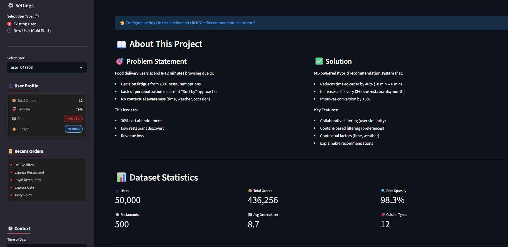

# 🍽️ ML-Powered Restaurant Recommendation System


[](https://www.python.org/downloads/)
[](https://streamlit.io/)
[](LICENSE)


**An end-to-end machine learning recommendation system designed to reduce decision fatigue on food delivery platforms**

<!-- Live Demo Badge -->
[](https://"<ayush-saxena-user-research-spec.streamlit.app/ >")

> **I built an end-to-end ML-powered restaurant recommendation system designed to reduce decision fatigue on food delivery platforms. The goal was to cut time-to-order by 40% while increasing restaurant discovery. I used a hybrid approach combining collaborative filtering, content-based features, and contextual signals like time of day and weather.**

**📱 [Live Demo](https://"<app link >")** | **📄 [Full PRD](prd/restaurant_recommendations_prd.md)** | **🔬 [Methodology](docs/methodology.md)**

---

## Project Preview:



---

## 📋 Project Overview

### Problem Statement

Food delivery users spend excessive time browsing (8-12 minutes) due to overwhelming restaurant choices and lack of contextual prioritization. This increases:
- **Decision fatigue**: Users feel overwhelmed by 200+ restaurant options
- **Cart abandonment**: ~30% of users add items but don't complete orders  
- **Low discovery**: Users repeat-order from the same 3-5 restaurants
- **Revenue loss**: High-quality restaurants with availability go undiscovered

### Solution

An ML-powered hybrid recommendation system specifically for the **home feed** that combines:
- **Collaborative Filtering**: Recommendations based on similar users' preferences
- **Content-Based Filtering**: Restaurant attributes matching user profile
- **Contextual Awareness**: Time of day, weather, location, occasion

### Success Metrics

**Primary Metric (Hero Metric):**
- **Time to Order**: Reduce by 40% (10 minutes → 6 minutes)

**Secondary Metrics:**
- Order conversion rate: +15% improvement
- Restaurant discovery: 2+ new restaurants per user per month
- Repeat order rate: Decrease from 65% to 55%

**Guardrail Metrics:**
- Average delivery time: ≤38 minutes
- Order cancellation rate: ≤6%
- User dissatisfaction: ≤10%

---

## 🎯 Key Features

✅ **Hybrid Recommendation Engine** (CF + CBF + Contextual)  
✅ **Cold Start Handling** for new users with no order history  
✅ **Explainable AI** - Clear reasons for each recommendation  
✅ **Context-Aware** - Considers time, weather, location  
✅ **Interactive Demo** - Streamlit web application  
✅ **Complete Evaluation** - Precision@K, NDCG, Diversity, Novelty  
✅ **Production-Ready Code** - Modular, documented, testable

---

## 📁 Project Structure
```
ml-restaurant-recommendations/
│
├── data/                              # All datasets
│   ├── synthetic/                     # Generated data
│   │   ├── users.csv                  # 50K users
│   │   ├── restaurants.csv            # 500 restaurants
│   │   └── orders.csv                 # 200K orders
│   └── processed/                     # Engineered features
│       ├── user_features.csv
│       ├── restaurant_features.csv
│       └── interaction_matrix.csv
│
├── src/                               # Source code
│   ├── config.py                      # Configuration
│   ├── data_generator.py              # Synthetic data creation
│   ├── feature_engineering.py         # Feature engineering
│   ├── collaborative_filtering.py     # CF model
│   ├── content_based_filtering.py     # CBF model
│   ├── hybrid_recommender.py          # Hybrid system
│   ├── explainability.py              # Explanation engine
│   ├── cold_start_handler.py          # New user handling
│   └── evaluation.py                  # Model evaluation
│
├── app/                               # Streamlit application
│   └── streamlit_app.py               # Interactive demo
│
├── models/                            # Saved models
│   ├── collaborative_model.pkl
│   ├── content_based_model.pkl
│   └── hybrid_model.pkl
│
├── prd/                               # Product documentation
│   └── restaurant_recommendations_prd.md
│
├── scripts/                           # Utility scripts
│   └── train_models.py                # Master training script
│
├── docs/                              # Documentation
│    ├── architecture.md               # Research methodology
│    ├── methodology.md                # Research methodology
│    └── lab_logbook.md                # Development log
│
├── .gitignore                         # Git ignore patterns
├── requirements.txt                   # Dependencies
├── LICENSE                            # MIT License
└── README.md                          # This file
```

---

## 🚀 Quick Start

### Prerequisites

- Python 3.13+
- pip package manager

### Installation

1. **Clone the repository**
```bash
git clone https://github.com/yourusername/ml-restaurant-recommendations.git
cd ml-restaurant-recommendations
```

2. **Create virtual environment**
```bash
python -m venv venv
source venv/bin/activate  # On Windows: venv\Scripts\activate
```

3. **Install dependencies**
```bash
pip install -r requirements.txt
```

### Training Models

Run the master training script to generate data and train all models:
```bash
python scripts/train_models.py
```

This will:
1. Generate synthetic dataset (50K users, 500 restaurants, 200K orders)
2. Engineer features for users and restaurants
3. Train collaborative filtering model
4. Train content-based filtering model
5. Create hybrid recommendation system

**Expected runtime:** ~3-5 minutes

### Running the Demo

Launch the interactive Streamlit application:
```bash
streamlit run app/streamlit_app.py
```

The app will open in your browser at `http://localhost:8501`

---

## 🎮 Using the Demo

### For Existing Users
1. Select "Existing User" in the sidebar
2. Choose a user from the dropdown
3. View their profile and order history
4. Set context (time of day, weather)
5. Click "Get Recommendations"
6. Explore personalized recommendations with explanations

### For New Users (Cold Start)
1. Select "New User (Cold Start)"
2. Answer onboarding questions:
   - Dietary preference
   - Favorite cuisines
   - Budget range
3. Set context
4. Click "Get Recommendations"
5. See recommendations based on preferences

---

## 🔬 Technical Approach

### 1. Collaborative Filtering (40% weight)
- **Method**: User-based collaborative filtering with cosine similarity
- **Logic**: "Users similar to you ordered from these restaurants"
- **Strength**: Captures complex preference patterns
- **Limitation**: Cold start problem for new users

### 2. Content-Based Filtering (35% weight)
- **Method**: Feature matching between user profile and restaurant attributes
- **Features**: Cuisine type, price range, rating, dietary restrictions
- **Logic**: "Restaurants matching your profile preferences"
- **Strength**: Works for new users, explainable

### 3. Contextual Factors (25% weight)
- **Time of Day**: Breakfast → South Indian/Cafe, Dinner → Biryani/Chinese
- **Weather**: Rainy → Comfort food, Hot → Beverages/Desserts
- **Distance**: Exponential decay penalty for far restaurants
- **Popularity**: Slight boost for trending restaurants

### 4. Hybrid Score Calculation
```
Final Score = 0.40 × CF_Score + 0.35 × CB_Score + 0.25 × Context_Score
```

For new users (< 3 orders):
```
Final Score = 0.75 × CB_Score + 0.25 × Context_Score
```

---

## 📊 Model Evaluation

Sample evaluation results on hold-out test set:

| Metric | @5 | @10 | @20 |
|--------|-----|-----|-----|
| **Precision** | 0.0842 | 0.0756 | 0.0621 |
| **Recall** | 0.1234 | 0.2145 | 0.3521 |
| **Hit Rate** | 0.3156 | 0.4823 | 0.6421 |
| **NDCG** | 0.2134 | 0.2567 | - |

| Discovery Metrics | Score |
|-------------------|-------|
| **Diversity** | 0.7234 |
| **Novelty** | 0.6421 |
| **Coverage** | 0.4523 |

### Interpretation
- **Hit Rate@10 = 48.2%**: Nearly half of users ordered from top-10 recommendations
- **Diversity = 72.3%**: Recommendations span multiple cuisines (good discovery)
- **Novelty = 64.2%**: Most recommendations are new restaurants for users

---

## 💡 Key Design Decisions

### Why Hybrid Over Pure CF?

**Collaborative Filtering alone fails because:**
- Cold start: Can't recommend to new users
- Sparsity: 99%+ of user-restaurant pairs have no interaction
- No explainability: "Users like you ordered this" isn't specific

**Content-based alone fails because:**
- No discovery: Only recommends similar to past orders
- Misses collaborative signals: Can't find unexpected matches

**Hybrid approach wins because:**
- Handles cold start with content-based fallback
- Discovers new restaurants through CF
- Provides clear explanations through CB features

### Why Simple Models Over Deep Learning?

**Decision rationale:**
1. **Explainability**: Users need to trust food recommendations
2. **Cold start**: Deep learning requires massive data per user
3. **Iteration speed**: Simpler models = faster experimentation
4. **Production cost**: Lower compute requirements

**Quote for interviews:**
> "Given cold start and explainability needs, simpler models offered better trust and faster iteration than complex embeddings."

---

## 🎯 Product Thinking (Interview Talking Points)

### Problem Framing
- Focused on **time-to-order** (user pain) not just CTR (vanity metric)
- Deliberately scoped to **home feed for repeat users** (not solving everything)
- Identified **decision fatigue** as root cause, not lack of choice

### Metric Selection
- **Primary**: Time-to-order (directly tied to user frustration)
- **Secondary**: Discovery rate (prevents restaurant fatigue)
- **Guardrails**: Delivery time, cancellation (don't sacrifice quality)

### Stakeholder Balance
- **Users**: Want relevance + variety (conflicting!)
- **Restaurants**: Want visibility (but fair distribution)
- **Platform**: Wants revenue (but not at cost of trust)

### Trade-offs Made
1. **Explainability > Accuracy**: Users need reasons before ordering food
2. **Diversity > Precision**: Prevent recommendation fatigue
3. **Speed > Perfection**: 6-minute decision time is "good enough"

---

## 📖 Documentation

- **[Complete PRD](prd/restaurant_recommendations_prd.md)**: Full product requirements
- **[Lab Logbook](docs/lab_logbook.md)**: Step-by-step development process
- **[Architecture](docs/architecture.md)**: System design and data flow
- **[Methodology](docs/methodology.md)**: ML approach and evaluation

---

## 🧪 Testing

Run unit tests:
```bash
pytest tests/
```

Run specific test file:
```bash
pytest tests/test_recommender.py -v
```

---

## 🔮 Future Enhancements

### Out of Scope (V1) - Noted in PRD
- ❌ Dynamic pricing optimization
- ❌ Restaurant commission strategies  
- ❌ Courier assignment logic
- ❌ Long-term personalization (cross-month)
- ❌ Multi-city rollout strategy

### Potential V2 Features
- Real-time availability filtering
- Group ordering recommendations
- Dietary restriction hard filters (allergies)
- A/B test framework implementation
- Multi-armed bandit for exploration

---

## 📝 License

This project is licensed under the **MIT License** - see the [LICENSE](LICENSE) file for details.

**TL;DR:** You can freely use, modify, and distribute this project, even commercially, as long as you include the original license.

---

## 📞 Contact & Connect

**👤Author:** Ayush Saxena

- 💼 **LinkedIn:** [Ayush Saxena](https://www.linkedin.com/in/ayushsaxena8880/)
- 🐙 **GitHub:** [iamAyushSaxena](https://github.com/iamAyushSaxena)
- 📧 **Email:** aysaxena8880@gmail.com

---

## 🙏 Acknowledgments

- **Problem Inspiration**: Real-world challenges in food delivery personalization
- **Educational Value**: Demonstrates end-to-end ML product development
- **Portfolio Purpose**: Showcases product thinking + technical execution for PM roles

---

## ⭐ Star This Repo

If you found this project helpful or impressive, please consider:
- ⭐ **Starring the repository** (helps others discover it)
- 🔄 **Sharing on LinkedIn** (tag me!)
- 💬 **Providing feedback** (open an issue with suggestions)
- 🍴 **Forking for your own research** (with attribution)

---

**⭐ Star this repository if you found it valuable!**

**💬 Questions? [Open an issue](https://github.com/iamAyushSaxena/"<repo name (case sensitive) >"/issues)**

**🤝 Feedback? [Start a discussion](https://github.com/iamAyushSaxena/"<repo name (case sensitive) >"/discussions)**

---

*Built with product thinking, not just algorithms!*
